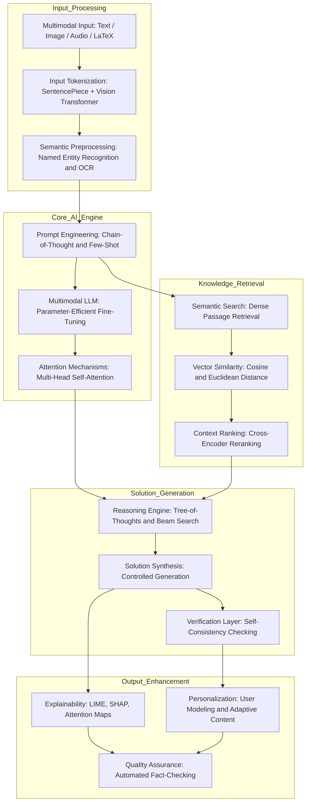
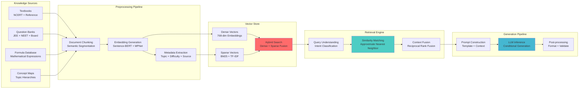
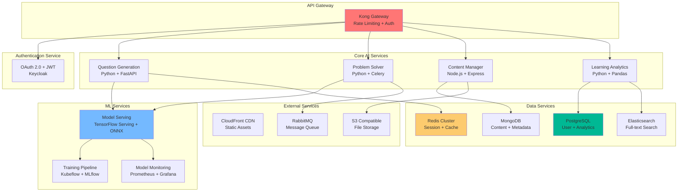

# Step Mentor 🚀

[](https://youtu.be/RVKZBXkMGrI?si=tPkwHpJ1tD4DzvjG)

> **⚠️ Note**: The demo video may show an earlier version of the platform due to continuous development and feature updates. The current system includes significantly more advanced AI capabilities and architectural improvements.
[](LICENSE)
[](https://python.org)
[](https://github.com/SaurabMishra12/Step-Mentor0)

---

## 🌟 Overview

**Step Mentor** is a next-generation, AI-native educational platform engineered for JEE aspirants and STEM students. Built on cutting-edge generative AI infrastructure, the platform leverages state-of-the-art transformer architectures, multimodal learning paradigms, and advanced retrieval-augmented generation (RAG) systems to deliver personalized, explainable, and adaptive learning experiences.

### 🎯 Mission Statement
*Democratizing access to world-class AI-powered education through transparent, personalized, and contextually-aware learning systems.*

---

## 🏗️ System Architecture

### High-Level Architecture Overview

graph TB
    subgraph "User Interface Layer"
        UI[Web Application<br/>Flask + Jinja2 + Bootstrap]
        Mobile[Mobile App<br/>React Native]
        API[REST API Gateway<br/>Flask-RESTful + OpenAPI]
    end
    
    subgraph "AI/ML Orchestration Layer"
        LLM[Multimodal LLM Engine<br/>Gemini Pro + Vision]
        RAG[RAG Pipeline<br/>LangChain + LlamaIndex]
        VectorDB[Vector Database<br/>Pinecone + Weaviate]
        Agents[Multi-Agent System<br/>CrewAI + AutoGen]
    end
    
    subgraph "Core Services"
        QGen[Question Generation<br/>Controlled Synthesis]
        Solver[Solution Engine<br/>CoT + ToT Reasoning]
        Tutor[AI Tutor<br/>RLHF + Persona Modeling]
        Analytics[Learning Analytics<br/>Recommendation Engine]
    end
    
    subgraph "Data Layer"
        KG[Knowledge Graph<br/>Neo4j + RDF]
        Content[Content Repository<br/>MongoDB + S3]
        UserData[User Analytics<br/>PostgreSQL + Redis]
    end
    
    UI --> API
    Mobile --> API
    API --> LLM
    API --> RAG
    LLM --> QGen
    LLM --> Solver
    LLM --> Tutor
    LLM --> Agents
    RAG --> VectorDB
    Agents --> QGen
    Agents --> Solver
    Agents --> Tutor
    Analytics --> KG
    Analytics --> Content
    Analytics --> UserData

### Advanced AI/ML Pipeline Architecture




### Retrieval-Augmented Generation (RAG) Architecture



### Microservices Architecture



---

## 🧠 Advanced AI/ML Capabilities

### 🔬 Core AI Technologies

- **🤖 Multimodal Foundation Models**
  - Google Gemini Pro for advanced reasoning and multimodal understanding
  - Gemini Vision for image and diagram interpretation
  - Custom fine-tuned models via LoRA/QLoRA for domain-specific tasks
  - Integration with open-source models (Llama 2, Mistral)

- **🔄 Multi-Agent Architecture (In Development)**
  - Specialized AI agents for different educational domains
  - Collaborative problem-solving through agent coordination
  - Teacher Agent for pedagogy and explanation generation
  - Student Agent for personalized learning path optimization
  - Evaluator Agent for assessment and feedback

- **🧪 Parameter-Efficient Fine-Tuning**
  - Low-Rank Adaptation (LoRA) for domain-specific tasks
  - Prefix Tuning for prompt optimization
  - Adapter layers for modular knowledge injection
  - Quantization-Aware Training (QAT) for efficient inference

- **🎯 Retrieval-Augmented Generation (RAG)**
  - Dense Passage Retrieval with FAISS/Pinecone
  - Hybrid search combining dense and sparse vectors
  - Contextual reranking with Cross-Encoder models
  - Real-time knowledge base updates

### 🔍 Advanced Reasoning Capabilities

- **🌳 Tree-of-Thoughts (ToT) Reasoning**
  - Multi-step problem decomposition
  - Parallel solution path exploration
  - Self-correction and validation mechanisms
  - Confidence scoring for solution quality

- **🔗 Chain-of-Thought (CoT) Prompting**
  - Step-by-step reasoning visualization
  - Intermediate step validation
  - Error detection and correction
  - Pedagogical explanation generation

- **🎨 Multimodal Understanding**
  - Mathematical expression recognition (OCR + LaTeX)
  - Diagram and graph interpretation
  - Handwritten text recognition
  - Visual-textual context integration

### 📊 Personalization & Adaptation

- **🎯 Adaptive Learning Algorithms**
  - Bayesian Knowledge Tracing
  - Item Response Theory (IRT) modelling
  - Deep Knowledge Tracing with LSTM/Transformer
  - Personalised difficulty adjustment

- **🧠 Student Modeling**
  - Cognitive load assessment
  - Learning style identification
  - Knowledge gap analysis
  - Optimal challenge zone targeting

---

## 🚀 Key Features

### 🎓 Intelligent Content Generation
- **Dynamic Question Synthesis**: Context-aware question generation using controlled text generation and constraint satisfaction
- **Adaptive Difficulty Scaling**: Real-time difficulty adjustment based on student performance metrics and learning trajectories
- **Multimodal Content Creation**: Automated generation of visual aids, diagrams, and interactive elements

### 🔍 Explainable AI Solutions
- **Transparent Reasoning Chains**: Step-by-step solution breakdowns with confidence intervals and uncertainty quantification
- **Attention Visualization**: Interactive attention maps showing model focus areas during problem-solving
- **Counterfactual Explanations**: "What-if" scenarios to demonstrate solution sensitivity to input variations

### 💬 Advanced Conversational AI
- **Context-Aware Dialogue Management**: Multi-turn conversation handling with memory and persona consistency
- **Socratic Questioning**: Guided discovery learning through strategic questioning techniques
- **Emotional Intelligence**: Sentiment analysis and empathetic response generation

### 📈 Learning Analytics & Insights
- **Real-time Performance Tracking**: Comprehensive learning analytics dashboard with predictive modeling
- **Mastery-Based Progression**: Competency-based advancement with granular skill assessment
- **Predictive Intervention**: Early warning systems for at-risk students using ML anomaly detection

---

## 🔬 Research & Development

- **🤖 Multi-Agent AI System**
  - Collaborative AI agents with specialized roles and expertise
  - Dynamic agent orchestration for complex problem-solving
  - Inter-agent communication and knowledge sharing protocols

- **🧠 Advanced Neural Architectures**
  - Mixture of Experts (MoE) models for specialized domains
  - Retrieval-Augmented Generation with dynamic knowledge updates
  - Constitutional AI for safety and alignment

- **🌐 Distributed Learning Infrastructure**
  - Federated learning across multiple educational institutions
  - Edge computing for reduced latency and improved privacy
  - Blockchain-based credential verification and achievement tracking

- **🎯 Next-Generation Personalization**
  - Neuro-symbolic reasoning for explainable AI decisions
  - Causal inference for understanding learning pathways
  - Quantum-inspired optimization for resource allocation

---

## 🏗️ Technical Stack

### Frontend Architecture
```
Flask 3.0 + Jinja2 + Bootstrap 5
├── Template Engine: Jinja2 + Custom Macros
├── CSS Framework: Bootstrap 5 + Custom SCSS
├── JavaScript: Vanilla JS + Alpine.js + HTMX
├── Math Rendering: KaTeX + MathJax
├── Visualization: Chart.js + D3.js
└── Testing: Pytest + Selenium
```

### Backend Infrastructure
```
Python 3.11 + Flask + SQLAlchemy
├── Web Framework: Flask + Flask-RESTful + Blueprints
├── Database ORM: SQLAlchemy + Alembic
├── Task Queue: Celery + Redis + RabbitMQ
├── Database: PostgreSQL + MongoDB + Neo4j
├── Caching: Redis Cluster + Memcached
├── Search: Elasticsearch + OpenSearch
└── Monitoring: Prometheus + Grafana + Sentry
```

### AI/ML Stack
```
PyTorch 2.0 + Transformers + LangChain
├── LLM Integration: Google Gemini Pro API + Vertex AI
├── Model Serving: TensorFlow Serving + ONNX Runtime
├── Multi-Agent Framework: CrewAI + AutoGen + LangGraph
├── Training: Kubeflow + MLflow + Weights & Biases
├── Vector Store: Pinecone + Weaviate + FAISS
├── NLP: spaCy + NLTK + Hugging Face Transformers
├── Computer Vision: OpenCV + Pillow + Tesseract
└── Optimization: Ray + Optuna + Hyperopt
```

### DevOps & Infrastructure
```
Kubernetes + Docker + Helm
├── Cloud Platform: AWS/GCP/Azure
├── CI/CD: GitHub Actions + ArgoCD
├── Service Mesh: Istio + Envoy
├── Monitoring: ELK Stack + Jaeger
├── Security: HashiCorp Vault + SOPS
└── Infrastructure: Terraform + Ansible
```

### Data Engineering Pipeline
```
Apache Airflow + dbt + Great Expectations
├── Data Ingestion: Apache Kafka + Kinesis
├── Processing: Apache Spark + Pandas + Polars
├── Storage: Delta Lake + Apache Iceberg
├── Warehousing: Snowflake + BigQuery
└── Lineage: DataHub + Apache Atlas
```

---

## 🚀 Quick Start Guide

### Prerequisites
```bash
# System Requirements
Python 3.11+
Node.js 18+
Docker 24+
Kubernetes 1.28+
```

### Local Development Setup
```bash
# 1. Clone the repository
git clone https://github.com/SaurabMishra12/Step-Mentor0.git
cd Step-Mentor0

# 2. Create virtual environment
python -m venv venv
source venv/bin/activate  # On Windows: venv\Scripts\activate

# 3. Install dependencies
pip install -r requirements.txt

# 4. Set up environment variables
cp .env.example .env
# Add your Gemini API key and other configurations

# 5. Initialize databases
python init_db.py

# 6. Start the Flask development server
python app.py
```

### Production Deployment
```bash
# Using Docker Compose
docker-compose -f docker-compose.prod.yml up -d

# Using Kubernetes
kubectl apply -f k8s/
helm install step-mentor ./helm-chart
```

---


## 🧪 Development Roadmap

### Phase 1: Foundation (Q1 2024) ✅
- [x] Core RAG pipeline implementation
- [x] Basic multimodal support
- [x] Web application MVP
- [x] User authentication system

### Phase 2: Intelligence (Q2 2025) 🚧
- [x] Advanced reasoning capabilities with Gemini Pro
- [x] Personalization engine
- [x] Multi-agent system foundation
- [ ] Mobile application
- [ ] Advanced analytics dashboard

### Phase 3: Scale (Q3 2025) 📋
- [ ] Complete multi-agent architecture deployment
- [ ] Microservices architecture migration
- [ ] Multi-language support
- [ ] Real-time collaboration features
- [ ] Advanced ML ops pipeline

### Phase 4: Innovation (Q4 2026) 🔮
- [ ] Federated learning implementation
- [ ] Quantum-inspired algorithms
- [ ] AR/VR integration
- [ ] Blockchain-based credentials
- [ ] Neuro-symbolic reasoning

---

## 🤝 Contributing

For contributions, write to me at saurab23@iisertvm.ac.in
---

## 📄 License

This project is licensed under the MIT License - see the [LICENSE](LICENSE) file for details.

---

## 🙏 Acknowledgments

- **Research Papers**: Attention Is All You Need, RAG, Chain-of-Thought Prompting
- **Open Source Libraries**: Transformers, LangChain, FastAPI, React
- **Educational Partners**: NCERT, JEE Preparation Institutes

---


## 📊 Analytics & Metrics

[](https://github.com/SaurabMishra12/Step-Mentor0/stargazers)
[](https://github.com/SaurabMishra12/Step-Mentor0/network/members)
[](https://github.com/SaurabMishra12/Step-Mentor0/issues)
[](https://github.com/SaurabMishra12/Step-Mentor0/graphs/contributors)

---

<div align="center">

**🚀 Empowering the next generation of learners with cutting-edge AI technology**

</div>
